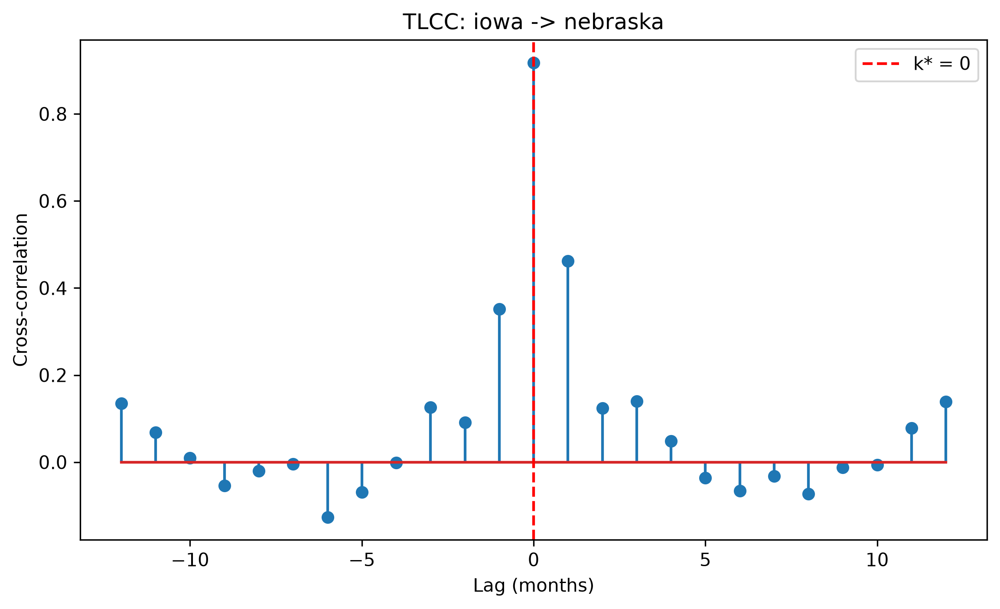
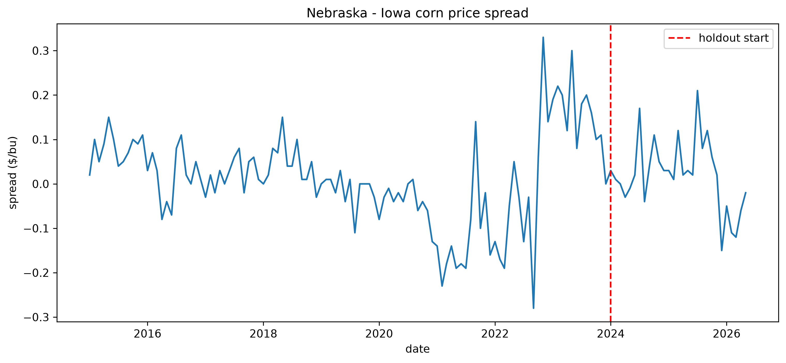
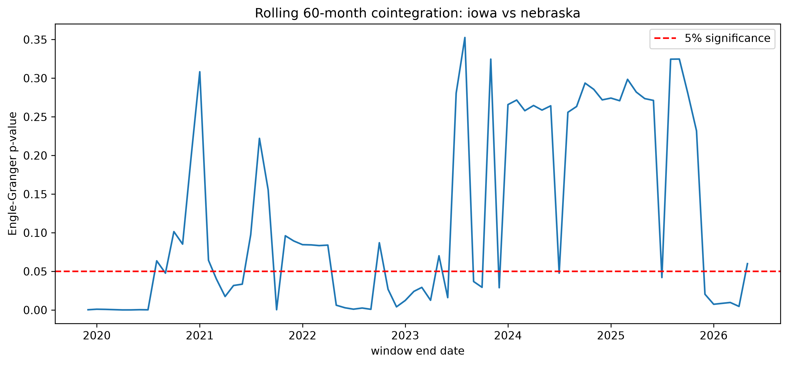

# Experiment: 2026-07-08_corn_iowa-nebraska_dfab18

**CORN — IOWA (hub) vs NEBRASKA (local)**, 2015–2026, holdout from 2024-01-01

Run at 2026-07-08T22:34:22 · git `7b76448` · 17.3s · 137 months of data

**Notes:** robustness pair

## Guide to this folder

| Path | Contents |
|---|---|
| `manifest.json` | exact params, git commit, package versions, data fingerprint |
| `data/panel.csv` | the cleaned monthly panel this run analyzed |
| `figures/tlcc_lag_curve.png` | cross-correlation vs. lag, k* marked |
| `figures/spread.png` | local−hub price spread over time, holdout marked |
| `figures/rolling_cointegration.png` | rolling 60-mo cointegration p-value vs. time |
| `tables/*.csv` | every number below, in machine-readable form |
| `logs/run.log` | full console output of this run |

## Headline results

| Metric | Value |
|---|---|
| k* (months, + = IOWA leads NEBRASKA) | 0 |
| k* 95% CI | [0.0, 0.0] |
| Peak correlation | 0.918 |
| Cointegration p-value (full period) | 0.0082 (cointegrated @ 5%) |
| Structural break (ZA) p-value | 0.0000 (SIGNIFICANT @ 5%) |
| Structural break candidate date | 2022-09-01 |
| Rolling cointegration, % windows significant | 46% (36/78) |

## Granger causality (minimum p-value across tested lags)

| Direction | min p-value | significant @ 5%? |
|---|---|---|
| IOWA → NEBRASKA | 0.0000 | Yes |
| NEBRASKA → IOWA | 0.1287 | No |

## Backtest stability (train-only vs. full period)

| Metric | Train | Full | Stable? |
|---|---|---|---|
| k* | 0 | 0 | Yes |
| IOWA→NEBRASKA Granger sig. | p=0.0022 | p=0.0000 | Yes |
| Cointegration sig. | p=0.0415 | p=0.0082 | Yes |

## Figures

---
Reproduce with: `python experiment.py --experiment-name 2026-07-08_corn_iowa-nebraska_dfab18 --commodity CORN --hub IOWA --local NEBRASKA --year-start 2015 --year-end 2026 --holdout-start 2024-01-01 --max-lag 12 --rolling-coint`