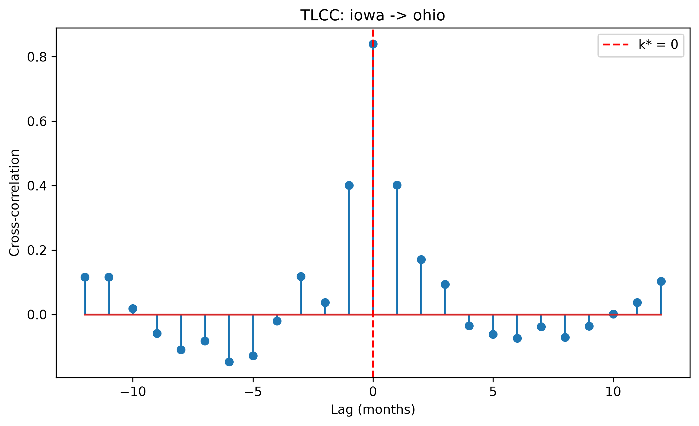
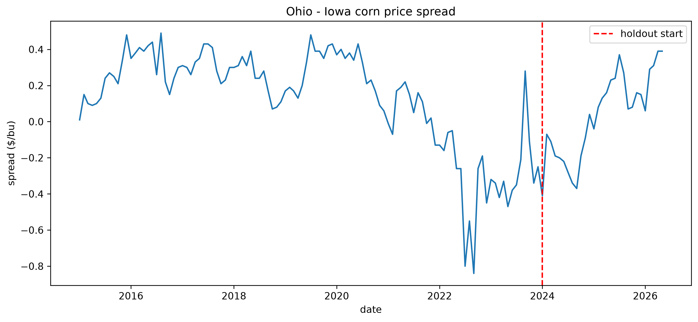
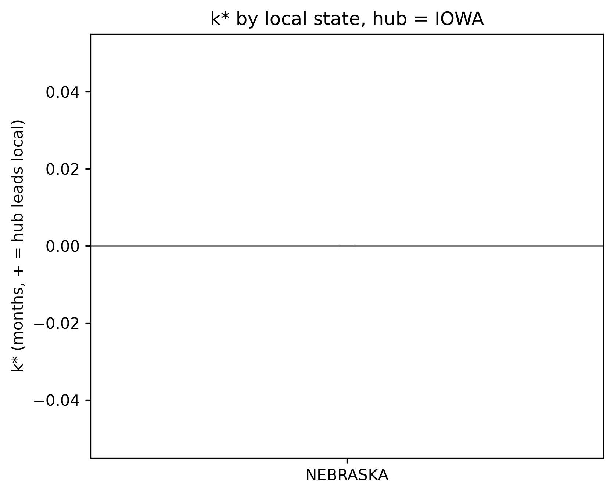

# Experiment: 2026-07-09_corn_iowa-ohio_171fb7

**CORN — IOWA (hub) vs OHIO (local)**, 2015–2026, holdout from 2024-01-01

Run at 2026-07-09T17:34:16 · git `7b76448` · 31.2s · 137 months of data

## Guide to this folder

| Path | Contents |
|---|---|
| `manifest.json` | exact params, git commit, package versions, data fingerprint |
| `data/panel.csv` | the cleaned monthly panel this run analyzed |
| `figures/tlcc_lag_curve.png` | cross-correlation vs. lag, k* marked |
| `figures/spread.png` | local−hub price spread over time, holdout marked |
| `figures/pair_robustness.png` | k* (with CI) across every tested local state |
| `tables/pair_robustness.csv` | full analysis re-run for each tested local state |
| `tables/*.csv` | every number below, in machine-readable form |
| `logs/run.log` | full console output of this run |

## Headline results

| Metric | Value |
|---|---|
| k* (months, + = IOWA leads OHIO) | 0 |
| k* 95% CI | [0.0, 0.0] |
| Peak correlation | 0.840 |
| Cointegration p-value (full period) | 0.1545 (not cointegrated @ 5%) |
| Structural break (ZA) p-value | 0.8224 (not significant @ 5%) |

## Granger causality (minimum p-value across tested lags)

| Direction | min p-value | significant @ 5%? |
|---|---|---|
| IOWA → OHIO | 0.0089 | Yes |
| OHIO → IOWA | 0.0467 | Yes |

## Backtest stability (train-only vs. full period)

| Metric | Train | Full | Stable? |
|---|---|---|---|
| k* | 0 | 0 | Yes |
| IOWA→OHIO Granger sig. | p=0.0045 | p=0.0089 | Yes |
| Cointegration sig. | p=0.0004 | p=0.1545 | No |

## Pair robustness (same hub, other local states)

| Local state | n months | k* | k* 95% CI | Peak corr | IOWA→local Granger p | Cointegrated (5%)? |
|---|---|---|---|---|---|---|
| NEBRASKA | 137.0 | 0.0 | [0.0, 0.0] | 0.918 | 0.0000 | Yes |

k* is **consistent at 0.0 months** across all 1 tested pairs — not specific to IOWA/OHIO.

Skipped (1): ILLINOIS (no cleaned panel found — run pipeline.py/clean.py for this pair first)

## Figures

---
Reproduce with: `python experiment.py --experiment-name 2026-07-09_corn_iowa-ohio_171fb7 --commodity CORN --hub IOWA --local OHIO --year-start 2015 --year-end 2026 --holdout-start 2024-01-01 --max-lag 12 --robustness-pairs NEBRASKA,ILLINOIS`